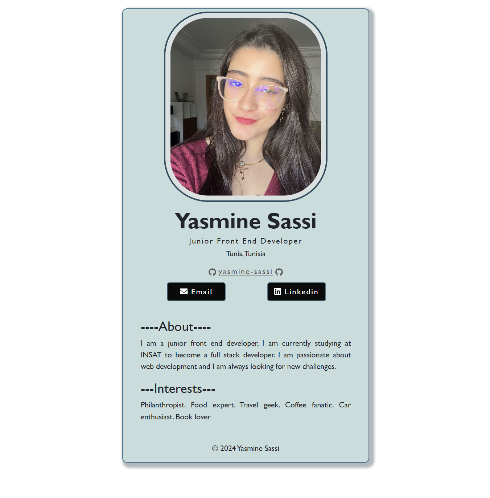

# Professional Business Card App

This is a professional digital business card built using Semantic HTML5 markup, CSS custom properties, React.JS, Flexbox.

## Features

- Display personal information such as name, job title, location, and contact details.
- Showcase skills and interests.
- Includes buttons for contacting the user via email, LinkedIn, and GitHub.
-  Responsive design ensuring that it works well on desktop, tablet, or mobile devices.

## Screenshot



# Installation


To run this app locally, follow these steps:

1. Clone the repository:

   ```bash
   git clone https://github.com/yasmine-sassi/digital-business-card.git
2. Navigate to the project directory:

   ```bash
   cd digital-business-card
3. Install dependencies:
   ```bash
   npm install
4. Install the FontAwesome package:
   ```bash
   npm install --save @fortawesome/fontawesome-svg-core
   npm install --save @fortawesome/free-solid-svg-icons
   npm install --save @fortawesome/free-regular-svg-icons
   npm install --save @fortawesome/free-brands-svg-icons
   npm install --save @fortawesome/react-fontawesome@latest
5. Start the server:
   ```bash
   npm run dev
6. Open your browser and navigate to  `http://localhost:5178`

## Contact

For any inquiries or feedback, feel free to contact me, the author